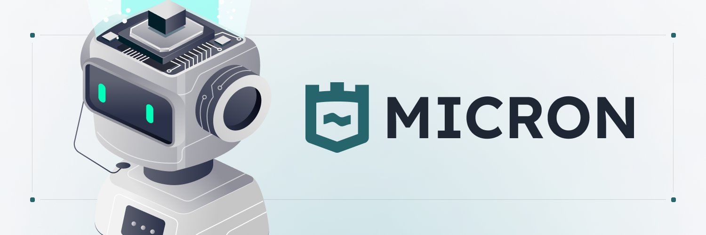

<h1 align="center">Micron SDK</h1>

<p align="center">
Advanced AI-powered SDK for Solana token analytics and risk assessment. Built on Solana's high-performance blockchain, it combines machine learning with comprehensive on-chain analytics for real-time token analysis, risk assessment, and AI agent interactions.
</p>

<div align="center">

[](https://www.typescriptlang.org/)
[](https://solana.com/)
[](https://openai.com/)
[](https://nodejs.org/)

[](https://github.com/micronsh/micron-sdk)
[](https://opensource.org/licenses/MIT)
[](https://github.com/micronsh/micron-sdk/graphs/commit-activity)

</div>

<p align="center">
  <a href="https://micron.sh">Website</a> •
  <a href="https://docs.micron.sh">Documentation</a> •
  <a href="https://docs.micron.sh">Roadmap</a>
</p>

## Installation

```bash
npm install micron-sdk
# or
yarn add micron-sdk
```

## Quick Start

```typescript
import MicronClient from 'micron-sdk';

// Initialize the client
const client = new MicronClient();

// Analyze a token
const analysis = await client.getToken('token-address');
console.log(`Token Score: ${analysis.data.score}`);
```

## 🔧 Core Features

- **Token Analytics**: Deep analysis of Solana tokens
- **Risk Assessment**: Advanced risk scoring and indicators
- **AI Agents**: Interactive AI-powered analysis
- **Batch Processing**: Efficient multi-token analysis
- **Real-time Data**: Live on-chain analytics

## 📊 Token Analysis Example

```typescript
import MicronClient from 'micron-sdk';

async function analyzeToken(address: string) {
  const client = new MicronClient();
  const analysis = await client.getToken(address);
  
  console.log(`
Token Analysis Results:
----------------------
Name: ${analysis.data.tokenName}
Score: ${analysis.data.score}/100
Market Cap: $${analysis.data.marketCap}
Risk Level: ${analysis.data.score < 50 ? 'High' : 'Low'}
LP Burned: ${analysis.data.auditRisk.lpBurned ? 'Yes' : 'No'}
  `);
}
```

## AI Agent Integration

```typescript
import { MicronClient, ChatMessage } from 'micron-sdk';

async function chatWithAgent() {
  const client = new MicronClient();
  const messages: ChatMessage[] = [{
    role: 'user',
    content: 'Analyze the risk factors for token ABC'
  }];
  
  const response = await client.chat('agent-id', messages);
  console.log('AI Analysis:', response.data.response);
}
```

## API Endpoints

### Token Analysis
```typescript
GET /v1/token/:address
```
Returns comprehensive token analysis including:
- Risk indicators and scoring
- Market metrics and valuation
- Liquidity pool analysis
- Ownership distribution
- Deployment details
- Audit risk factors

Response type:
```typescript
interface TokenData {
  tokenName: string;
  tokenSymbol: string;
  score: number;         // 0-100 risk score
  marketCap: number;
  deployTime: string;
  auditRisk: {
    mintDisabled: boolean;
    freezeDisabled: boolean;
    lpBurned: boolean;
    top10Holders: boolean;
  };
  indicatorData: {
    high: { count: number; details: string; };
    moderate: { count: number; details: string; };
    low: { count: number; details: string; };
  };
  // ... other fields
}
```

### AI Agents

#### List Available Agents
```typescript
GET /v1/agents
```
Returns all available AI agents with their capabilities:
- Agent identification
- Supported analysis types
- Specialization areas
- System configuration

Response type:
```typescript
interface Agent {
  id: string;
  name: string;
  description: string;
  capabilities: ('token_analysis' | 'market_analysis' | 'risk_assessment')[];
}
```

#### Get Specific Agent
```typescript
GET /v1/agents/:id
```
Returns detailed information about a specific agent:
- Complete agent profile
- Available capabilities
- System configuration
- Specialization details

#### Chat with Agent
```typescript
POST /v1/agents/:id/chat
```
Interactive conversation with AI agents:
- Token analysis requests
- Risk assessment queries
- Market insights
- Custom analysis requests

Request body:
```typescript
{
  messages: [
    {
      role: 'user' | 'assistant' | 'system' | 'function';
      content: string;
      name?: string;
    }
  ]
}
```

Response type:
```typescript
interface AgentResponse {
  response: string;    // AI-generated analysis
  timestamp: string;   // Response timestamp
}
```

### Error Handling

All endpoints return standardized error responses:

```typescript
interface ErrorResponse {
  error: string;       // Error type
  message: string;     // Detailed message
  statusCode: number;  // HTTP status code
  timestamp: string;   // Error timestamp
}
```

Common status codes:
- `404`: Resource not found
- `429`: Rate limit exceeded
- `400`: Invalid request
- `500`: Server error

## 🔍 Advanced Usage

### Batch Processing
```typescript
import { MicronClient, TokenData, ApiResponse } from 'micron-sdk';

async function batchAnalysis(addresses: string[]) {
  const client = new MicronClient();
  const batchSize = 5;
  
  for (let i = 0; i < addresses.length; i += batchSize) {
    const batch = addresses.slice(i, i + batchSize);
    const analyses = await Promise.all(
      batch.map(addr => client.getToken(addr))
    );
    
    // Process batch results
    analyses.forEach(analysis => {
      if (analysis.data.score < 50) {
        console.log(`High Risk Token: ${analysis.data.tokenName}`);
        console.log(`Risk Factors: ${JSON.stringify(analysis.data.indicatorData)}`);
      }
    });
  }
}
```

### Error Handling Patterns
```typescript
import { MicronClient } from 'micron-sdk';

async function robustTokenAnalysis(address: string) {
  const client = new MicronClient();
  
  try {
    const analysis = await client.getToken(address);
    return analysis;
  } catch (error: any) {
    switch (error.statusCode) {
      case 404:
        console.error('Token not found');
        break;
      case 429:
        // Implement retry logic
        console.error('Rate limit exceeded, retrying...');
        await new Promise(resolve => setTimeout(resolve, 1000));
        return robustTokenAnalysis(address);
      default:
        console.error('API Error:', error.message);
    }
    throw error;
  }
}
```

### Conversation Management
```typescript
import { MicronClient, ChatMessage } from 'micron-sdk';

class ConversationManager {
  private client: MicronClient;
  private messages: ChatMessage[] = [];
  private agentId: string;

  constructor(agentId: string) {
    this.client = new MicronClient();
    this.agentId = agentId;
  }

  async sendMessage(content: string) {
    this.messages.push({ role: 'user', content });
    
    const response = await this.client.chat(this.agentId, this.messages);
    this.messages.push({ 
      role: 'assistant', 
      content: response.data.response 
    });

    return response.data;
  }

  getHistory() {
    return this.messages;
  }

  clearHistory() {
    this.messages = [];
  }
}
```

### Custom Configuration
```typescript
import { MicronClient } from 'micron-sdk';

// Production with custom timeout
const timeoutController = new AbortController();
setTimeout(() => timeoutController.abort(), 5000);

const client = new MicronClient('https://api.micron.sh');
await client.getToken('address', { 
  signal: timeoutController.signal,
  headers: {
    'Custom-Header': 'value'
  }
});
```

### Parallel Analysis
```typescript
import { MicronClient, TokenData } from 'micron-sdk';

async function compareTokens(addresses: string[]) {
  const client = new MicronClient();
  
  // Parallel token analysis
  const analyses = await Promise.all(
    addresses.map(addr => client.getToken(addr))
  );

  // Sort by score
  const sortedByRisk = analyses.sort(
    (a, b) => a.data.score - b.data.score
  );

  // Generate comparison report
  return sortedByRisk.map(analysis => ({
    name: analysis.data.tokenName,
    score: analysis.data.score,
    marketCap: analysis.data.marketCap,
    riskLevel: analysis.data.score < 50 ? 'High' : 'Low'
  }));
}
```

## Documentation

For detailed documentation, visit [docs.micron.sh](https://docs.micron.sh)

## Roadmap

- [ ] WebSocket support for real-time updates
- [ ] Advanced token metrics
- [ ] Custom AI agent training
- [ ] GraphQL API support
- [ ] Browser extension integration

## License

MIT © [Micron Team](LICENSE)